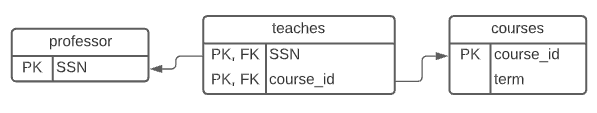
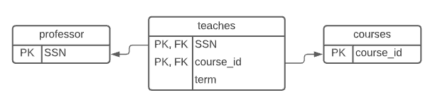
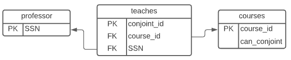

# CSI2532 Lab 4


## Modele ER

### Q1



#### Schema

```sql
CREATE TABLE professor (
	SSN varchar(9),
	PRIMARY KEY (SSN)
);

CREATE TABLE courses (
	course_id varchar(30),
  	term varchar(30),
	PRIMARY KEY (course_id)
);

CREATE TABLE teaches (
	SSN varchar(9),
  	course_id Varchar(30),
  	PRIMARY KEY (SSN, course_id),
  	FOREIGN KEY (SSN) REFERENCES professor(SSN),
  	FOREIGN KEY (course_id) REFERENCES courses(course_id)
);
```

### Q3


#### Schema

```sql
CREATE TABLE professor (
	SSN varchar(9),
	PRIMARY KEY (SSN)
);

CREATE TABLE courses (
	course_id varchar(30),
  	term varchar(30),
	PRIMARY KEY (course_id)
);

CREATE TABLE teaches (
	SSN varchar(9),
  	course_id Varchar(30),
  	PRIMARY KEY (SSN),
  	FOREIGN KEY (SSN) REFERENCES professor(SSN),
  	FOREIGN KEY (course_id) REFERENCES courses(course_id)
);
```

### Q5



#### Schema

```sql
CREATE TABLE professor (
	SSN varchar(9),
	PRIMARY KEY (SSN)
);

CREATE TABLE courses (
	course_id varchar(30),
  	PRIMARY KEY (course_id)
);

CREATE TABLE teaches (
	SSN varchar(9),
  	course_id Varchar(30),
  	term varchar(30),
  	PRIMARY KEY (SSN, course_id),
  	FOREIGN KEY (SSN) REFERENCES professor(SSN),
  	FOREIGN KEY (course_id) REFERENCES courses(course_id)
);
```

### Q6



#### Schema

```sql
CREATE TABLE professor (
	SSN varchar(9),
	PRIMARY KEY (SSN)
);

CREATE TABLE courses (
	course_id varchar(30),
  	can_conjoint boolean,
	PRIMARY KEY (course_id)
);

CREATE TABLE teaches (
  	conjoint_id int,
	SSN varchar(9),
  	course_id Varchar(30),
  	PRIMARY KEY (conjoint_id),
  	FOREIGN KEY (SSN) REFERENCES professor(SSN),
  	FOREIGN KEY (course_id) REFERENCES courses(course_id)
);
```

